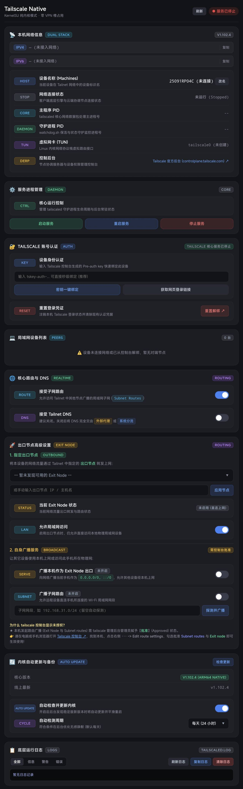

# Tailscale Native for KernelSU

基于 **KernelSU** 的原生内核模式 **Tailscale** 管理模块，专为 Android 设备设计。

无需占用 Android 系统的 VPN 虚拟接口插槽（可与 Clash、Surge、v2ray 等分流代理共存），直接使用官方原生 Linux 静态二进制文件与内核 TUN 设备，提供极致网络性能与低开销，并集成与参考设计一致的高颜值暗黑风格 **WebUI** 控制面板。

---

## 📸 WebUI 控制面板预览

模块集成了专为 Android 移动端触控优化的高颜值暗黑科技风 **WebUI** 控制面板，在 KernelSU 管理器内直接打开：

<div align="center">
  
</div>

### 🎨 界面视觉与交互特色
- **大标题专属标志体系**：卡片大标题均配有专属矢量标志与业务胶囊标签（`DUAL STACK` / `DAEMON` / `AUTH` / `PEERS` / `REALTIME` / `EXIT NODE` / `AUTO UPDATE` / `LOGS`）。
- **统一 68px 微拟物科技胶囊**：内部各参数行均对齐 68px 宽度的微拟物高科技胶囊标签（如 `HOST`, `STATE`, `CORE`, `DAEMON`, `TUN`, `DERP` 等），严格杜绝视觉杂乱，排版与交互层次清晰。
- **原生双栈触控芯片**：IPv4 / IPv6 触控芯片卡片，一键即时复制地址；支持随时修改 Tailnet 设备标识主机名。
- **独立双 PID 进程监控**：主网络核心进程 (`CORE`, tailscaled) 与看门狗保活守护进程 (`DAEMON`, watchdog.sh) 独立监控显示，进程运行状态一目了然。
- **服务生命周期管控**：支持一键「启动服务」「平滑重启」「停止服务」，状态指示灯实时反馈。
- **账号极速认证绑定**：支持 Pre-auth key 密钥秒级一键绑定，或快速生成 Web 授权链接，兼具凭据一键重置解绑。
- **局域网设备与测速 (Peers)**：即时展示 Tailnet 节点在线状态、Direct P2P 直连通道与中继状态，内置平滑常驻 Ping 延迟测速探测器。
- **分流路由与 DNS 协同**：支持一键切换接受子网路由 (Accept Routes) 与接受 Tailnet DNS (Accept DNS)，可自主将 DNS 完全交由外部代理（Clash/Surge）分流。
- **出口节点深度设置 (Exit Node)**：集成防跳动下拉选择器、一键应用/停用出口节点、允许本地局域网设备免分流（Allow LAN Access）；支持广播本机为 0.0.0.0/0 全局出口，或自动探测物理 Wi-Fi 网段并广播子网。
- **内核无感静默更新**：支持在线版本检测、自动静默升级与旧版本备份，检测周期支持自由定制。
- **暗黑终端底层运行日志**：终端控制台实时查看底层运行状态，支持 ALL / INFO / WARN / ERROR 分类筛选、日志刷新、一键复制与清除。

---

## 🌟 核心特性

- 🚀 **原生内核网络 (Non-VPN Mode)**：直接通过 Linux 内核 TUN 驱动 (`tailscale0`) 和策略路由接入 Tailnet，不占用系统 VPN 接口。
- 📱 **KernelSU WebUI 原生控制**：在 KernelSU 管理器内直接打开 WebUI，无需安装第三方管理 App。
- 🔑 **灵活认证绑定**：支持使用 `tskey-auth-...` 密钥一键静默登录，或直接获取 Web 授权链接完成浏览器单点登录。
- 🌐 **Exit Node 出口节点管理**：
  - 支持将指定 Tailnet 节点设置为手机上网出口，并支持允许本地局域网访问 (Allow LAN Access)。
  - 支持将当前手机作为出口节点广播至 Tailnet (`0.0.0.0/0, ::/0`)。
- 📡 **Subnet Router 子网路由广播**：
  - 自动探测手机当前连接的 Wi-Fi 内网网段（如 `192.168.2.0/24`），一键向 Tailnet 广播内网路由。
- ⚡ **核心路由与 DNS 实时生效**：一键切换 Accept Subnet Routes 与 Accept MagicDNS。
- 🛡️ **Android 原生网络适配与 DNS 修复**：内置 `/system/etc/resolv.conf` 自动补全机制，动态同步系统默认网关到 `table main`，彻底解决 Go 静态二进制在 Android 下出现的 `failed to resolve "controlplane.tailscale.com"` 及 `connect: network is unreachable` 问题。
- ⚙️ **自定义后台与出站代理**：支持在 WebUI 中直接配置自定义 Headscale 控制服务器地址，以及出站代理（`HTTP/SOCKS5 Proxy`，如 `http://127.0.0.1:7890`），应对特定网络环境下的阻断。
- 🔄 **内核自动更新与备份**：内置检测更新与静默升级机制，启动自动备份旧版本。
- 📜 **实时守护进程日志**：终端黑框实时滚动查看 `tailscaled` 运行日志，支持一键清空与复制。

---

## 📦 模块目录结构

```text
tailscale-kernelsu/
├── module.prop                  # 模块元数据 (id: tailscale_native)
├── customize.sh                 # KernelSU 安装与配置迁移脚本
├── service.sh                   # 开机启动脚本 (初始化 TUN、IP转发、启动服务)
├── uninstall.sh                 # 卸载清理脚本
├── icon.png                     # 模块图标
├── preview.jpg                  # WebUI 控制面板高清界面预览图
├── tailscale-native-v1.102.4.zip# 编译打包好的即刷即用 ZIP 模块文件 (运行 ./build.sh 一键生成)
├── system/
│   └── bin/
│       ├── tailscale            # 官方 ARM64 tailscale CLI
│       └── tailscaled           # 官方 ARM64 tailscaled 守护进程
├── scripts/
│   ├── control.sh               # 后台控制脚本 (status, start, stop, login, routes, exit-node 等)
│   ├── iptables.sh              # 策略路由与 NAT Masquerade 防火墙规则
│   └── update.sh                # 内核检查与在线更新脚本
├── webroot/                     # KernelSU WebUI 前端资源
│   ├── index.html               # 控制面板页面
│   ├── style.css                # 赛博暗黑主题样式
│   ├── app.js                   # 前端控制器与 ksu.exec 桥接逻辑
│   └── icon.png                 # WebUI 图标
└── build.sh                     # 模块打包脚本
```

---

## 📲 安装与使用指南

### 1. 刷入模块
1. 将 `tailscale-native-v1.102.4.zip` 传输到手机。
2. 打开 **KernelSU 管理器** -> 切换到 **模块** 页面。
3. 点击 **安装**，选择该 `.zip` 压缩包进行刷入。
4. 刷入完成后重启设备。

### 2. 打开 WebUI 控制面板
1. 重启后打开 **KernelSU 管理器**。
2. 找到 **Tailscale Native** 模块，点击右侧的 **WebUI** 按钮即可打开控制面板。

### 3. 设备登录绑定
- **密钥登录（推荐）**：在 [Tailscale Admin Console](https://login.tailscale.com/admin/settings/keys) 生成 Auth Key，粘贴到输入框中点击“使用密钥一键绑定”。
- **网页授权登录**：点击“获取网页登录链接”，点击链接或复制至浏览器打开即可完成授权绑定。

### 4. 路由与 Exit Node 广播说明
在手机上开启“广播本机作为 Exit Node 出口”或“广播子网路由”后：
1. 登录 [Tailscale Machines 管理后台](https://login.tailscale.com/admin/machines)。
2. 找到当前设备，点击右侧的 `···` 菜单 -> **Edit route settings**。
3. 勾选批准（Approve）对应的 Subnet 路由与 Exit node，其他设备即可生效使用。

